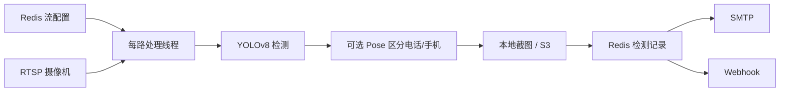

# VisionAI

多路 **RTSP** 视频分析：YOLOv8（COCO）检测 + 打电话/玩手机（可选 **YOLOv8-pose**）+ 可选吸烟（ONNX）；告警进 **Redis**，截图可落盘或 **S3**；**Flask** 管理端配置每路流与检测项。

**仓库**：<https://github.com/jiaxu-wang/visionai>

---

## 快速开始

```bash
git clone https://github.com/jiaxu-wang/visionai.git
cd visionai
python3 -m venv env && source env/bin/activate   # Windows: env\Scripts\activate
pip install -r requirements.txt
# 先起 Redis（可用本仓库 docker-compose 仅起 redis）。本机跑应用时常见：
# export REDIS_HOST=127.0.0.1 REDIS_PORT=16379
./start.sh
```

- 管理端：<http://服务器IP:5000>；默认密钥见 `config/config.example.ini` 的 `visionai_secret`，生产请改或用 `VISIONAI_SECRET` / `SECRET` 覆盖。  
- 停止：`./stop.sh`  
- `start.sh` 会设置本机友好的 `REDIS_*`、`SAVE_DIR`、`LOG_DIR`；与 `config/config.ini` 中 Docker 专用项冲突时以环境变量为准。  
- 若需桌面 GUI 版 OpenCV，可将 `opencv-python-headless` 换为 `opencv-python`。

### Docker Compose

`docker-compose.yaml` **默认仅 Redis + MinIO**；`visionai` 服务块需在文件内按需取消注释并挂载 `./config`、`./snapshots`、`./logs`。

```bash
docker compose up -d --build
```

宿主跑应用时请设 `REDIS_HOST`/`REDIS_PORT` 与 compose 中端口、`requirepass` 一致；容器访问摄像机 RTSP 勿用 `127.0.0.1`。MinIO 示例：API `9000`，控制台 `9001`。

---

## 功能一览

| 能力 | 说明 |
|------|------|
| 多路与稳定 | 每路独立线程；读帧失败自动重连 |
| COCO + 扩展 | **80 类**按流开关（`detection_catalog.py`）；新增流默认全关检测 |
| 打电话 / 玩手机 | 人与 `cell phone` 框重叠后，可用姿态区分贴耳通话（`CALLING`）与把玩（`PLAY_PHONE`）；可关 `pose_for_phone_enabled` 仅用几何启发 |
| 吸烟 | 人体裁剪 + ONNX；可选香烟 YOLO 门控减轻误报（见「检测与模型」） |
| 告警 | 写 Redis 后按 `save_interval` 触发 **SMTP**（全局 `SMTP_*`，每路 `alert_emails` / `alert_email_enabled`）与 **Webhook**（`alert_webhook_urls`，实现见 `visionai/utils/alert_webhook.py`） |
| Web | 状态概览、事件监控（流/检测项/告警配置 → Redis）、历史告警、流预览 |
| 训练实验室（MVP） | **`/training`**：RTSP 截帧 → YOLO 画框标注 → Web 训练；**验证**：上传图或 RTSP 单次/循环（默认 5s）推理、`best.pt` 可选下拉；日志含检测 JSON 与带框快照（数据在 `training_lab_data/`，已忽略） |

流配置只在 **Redis** 里维护（Web「事件监控」），不再使用 `settings.py` 硬编码列表。保存检测项与告警后一般**下一轮检测即可生效**，大改可先 **重启进程**。

---

## 技术栈

Python 3.12 · OpenCV（Docker 推荐 headless）· Ultralytics YOLOv8 · Flask / flask-sock · Redis · boto3 · onnxruntime · aiortc（WebRTC 预览）。

依赖见 `requirements.txt`。**不入 Git**：`*.pt` / `*.onnx`、`models/hf_smoking/`、训练数据、`training_system/runs/` 等须自备（`scripts/`、`training_system/README.md`）。

---

## 仓库结构与数据流

```
VisionAI/
├── visionai/
│   ├── __main__.py              # 入口：拉流线程 + Flask
│   ├── config/                  # settings.py、detection_catalog.py
│   ├── core/                    # detector、pose_phone、stream_handler、redis_manager、
│   │                            # behaviors/、object_storage、preview_*
│   ├── utils/                   # logger、rtsp_url、alert_email、alert_webhook
│   └── web/                     # app.py、templates、static
├── config/                      # config.example.ini → config.ini
├── scripts/
├── training_system/
├── training_lab_data/           # Web 训练实验室数据（本地，不入库）
├── snapshots/   logs/
├── Dockerfile   docker-compose.yaml
└── start.sh     stop.sh
```

处理线程从 Redis 读流配置；检测 → 可选 Pose → 截图（本地/S3）→ Redis 检测记录 → 邮件 / Webhook。下图略去 Web 写配置与管理端预览。



---

## 配置

**优先级**：环境变量 → 项目根 `config/config.ini`（`[visionai]`，键**小写**）→ `visionai/config/settings.py` 默认值。**改 ini / 环境变量后需重启进程**。也可用 `VISIONAI_CONFIG` 指定其它 ini。不建议把整块 `settings.py` 当配置挂载。

| 变量（env 多为大写） | 含义 | 默认 |
|---------------------|------|------|
| `DETECTION_INTERVAL` | 检测间隔（秒） | 15 |
| `CONF_THRESHOLD` | 置信度 | 0.5 |
| `SAVE_DIR` / `SAVE_INTERVAL` | 截图目录 / 最小间隔（秒） | `./snapshots` / 10 |
| `YOLO_MODEL` / `YOLO_DEVICE` | 权重与设备 | `yolov8n.pt` / 自动 |
| `POSE_MODEL` / `POSE_FOR_PHONE_ENABLED` | 姿态权重与是否用于电话手机 | `yolov8n-pose.pt` / true |
| `ONNX_PROVIDER` | 吸烟 ONNX：`cpu` 或 `cuda_first` | `cpu` |
| `REDIS_*` / `LOG_*` | 连接与前缀 / 日志 | 见 `config.example.ini` |
| `DETECTION_RETENTION_DAYS` | Redis 检测过期（天）；与对象存储生命周期天数对齐思路 | 1 |
| `SMTP_*` | 全局邮件告警 | 默认关 |

模板：`config/config.example.ini` → 复制为 `config/config.ini`（已在 `.gitignore`）。

### 对象存储（可选）

S3 兼容：`OBJECT_STORAGE_ENABLED`、`S3_*`、`S3_PATH_PREFIX`。`OBJECT_STORAGE_KEEP_LOCAL=true` 时本机保留副本；历史图可用 `/api/alert-image/<id>` 回源。`S3_LIFECYCLE_ENABLED`（默认开）可按前缀合并桶生命周期；对象按**上传日起算** N 天，与 Redis Hash 续期语义不同但 N 同源 `detection_retention_days`。细节见 `visionai/core/object_storage.py`。

---

## HTTP API（需登录）

**流与记录**：`GET/POST /api/streams`、`GET /api/stream-status`、`GET /api/detection-catalog`、`GET /api/detections`（支持时间/流/类型/分页）、`DELETE /api/detections/<id>`、`DELETE /api/detections/batch`。  
**告警与图**：`GET /snapshots/<path>`、`GET /api/alert-image/<id>`、`GET /api/stats/alerts-today`。  
**运维**：`POST /api/restart`（依赖本机 `start.sh`/`env` 布局；Docker 请自行重启容器）、`GET /api/config`（含预览与 `smtp.ready`）。  
**预览**：`GET /api/preview?stream_id=`（MJPEG）、`WS /ws/preview`、`POST /api/preview-webrtc/*`、`POST /api/preview-hls/*`、`GET /api/preview-hls/data/...`。  
**训练实验室**：`GET /training`；`GET/DELETE /api/training/projects`；`GET .../weights`；`POST .../validate/{upload,run-once,start,stop}`；`GET .../validate/{logs,status,snap/…}`；以及截帧、标注、训练、任务日志等 API。

---

## 检测与模型

- 标准物体：见 `detection_catalog.py` 与 COCO 索引。  
- 打电话 / 玩手机：记录里的展示名分别为「打电话」「玩手机」，画面标注 `CALLING` / `PLAY_PHONE`。实现见 `detector.py`、`pose_phone.py`。  
- 吸烟：人物裁剪 + ViT ONNX（`SMOKING_MODEL_PATH`）；可选 `SMOKING_CIGARETTE_DETECTOR_PATH` 先检香烟再跑 ViT。自定义 `.pt` 须与类别表一致。  

训练导出见 **`training_system/README.md`**。

---

## 性能与运维注意

- 多路与分辨率线性消耗 CPU/GPU/带宽；首跑可能自动拉取权重。  
- 预览：**WebRTC**（低延迟）、**WebSocket**/ **MJPEG**（可与检测缓存同步画框）、**HLS**（高延迟、`ffmpeg`）。WebRTC/HLS 多为原画。配置键 `preview_*`。复杂 NAT 可改用 WebSocket 或自建 **TURN**（规划中）。  
- RTSP URL 密码含 `@` 时需编码为 `%40`，见 `utils/rtsp_url.py`。注意摄像头并发连接上限。

---

## 路线图（节选）

- [x] 多路流、Web、Redis、历史告警、COCO 按流、Compose、预览多模式、吸烟、邮件、Webhook  
- [x] Web 训练实验室 MVP（`/training`：RTSP 截帧 + 标注 + 触发训练 + 下载权重）  
- [ ] 更多业务类别（安全帽等需自训类别表）、上传图片/视频标注、生产 **TURN**、系统设置页扩展
