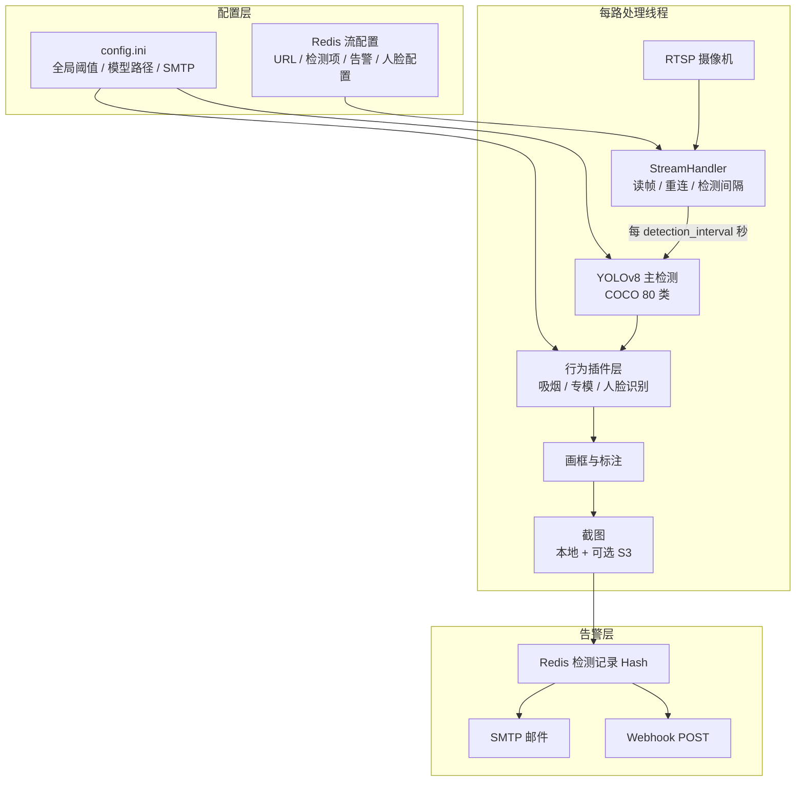

# VisionAI

多路 **RTSP** 视频智能分析平台：YOLOv8（COCO 80 类）主检测 + 行为扩展层（吸烟、打电话、专模 ONNX/YOLO）+ **人脸识别**（buffalo_l）；告警写入 **Redis**，截图可落盘或上传 **S3/MinIO**；**Flask** 管理端配置每路流、检测项与告警方式。

**仓库**：<https://github.com/jiaxu-wang/visionai>

---

## 目录

- [功能一览](#功能一览)
- [系统架构](#系统架构)
- [仓库结构](#仓库结构)
- [环境要求](#环境要求)
- [快速开始](#快速开始)
- [模型准备](#模型准备)
- [配置说明](#配置说明)
- [管理端使用指南](#管理端使用指南)
- [人脸识别](#人脸识别)
- [HTTP API](#http-api需登录)
- [检测与模型](#检测与模型)
- [运维与排障](#运维与排障)
- [路线图](#路线图)

---

## 功能一览

| 能力 | 说明 |
|------|------|
| 多路 RTSP | 每路独立线程；读帧失败自动重连；离线流周期性探测恢复 |
| COCO 80 类 | 按流单独开关（人物、手机、车辆等），见 `detection_catalog.py` |
| 扩展检测 | 吸烟、打电话、睡觉、安全帽、跌倒、火焰等专模（`.pt` / `.onnx`） |
| 打电话 / 玩手机 | 人与 `cell phone` 框重叠后，可用 **YOLOv8-pose** 区分贴耳通话与把玩 |
| **人脸识别** | buffalo_l（SCRFD + ArcFace）检测对齐；Redis 人脸库 1:N；照片存 MinIO |
| 人员聚集 | 单帧人数 ≥ 阈值，可选持续时长防抖 |
| 告警外发 | 写 Redis 后按 `save_interval` 触发 **SMTP** 与 **Webhook** |
| 对象存储 | 可选 MinIO / 云 S3；截图键前缀 `visionai/snapshots/` |
| Web 管理端 | 状态概览、事件监控、历史告警、系统设置、人脸库、流预览 |
| 训练实验室 | `/training`：RTSP 截帧 → 标注 → 训练 → 验证（MVP） |

流配置**只存在 Redis** 中（Web「事件监控」维护），不再硬编码在 `settings.py`。保存后一般**下一轮检测周期即生效**；修改 `config.ini` 或模型文件后需 **重启进程**。

---

## 系统架构

### 进程模型

单进程 `python3 -m visionai` 同时运行：

1. **Flask Web 服务**（默认 `0.0.0.0:5000`）— 管理端、API、流预览
2. **每路 RTSP 处理线程** — 拉流 → 检测 → 截图 → 写 Redis → 发告警
3. **离线流探测线程** — 周期性尝试拉起已配置但离线的流
4. **禁用流状态线程** — 维护已禁用流在界面上的状态

### 单路处理流水线



### 行为插件层

`visionai/core/behaviors/` 采用插件注册模式（`registry.py`）：

| 插件 | 键名 | 依赖 |
|------|------|------|
| 吸烟 | `smoking` | YOLO 专模或 ViT ONNX |
| 打电话专模 | `call` | `make_call.onnx` |
| 人脸检测（专模） | `face` | `face_detection.onnx` |
| **人脸识别** | `face_recognition` | `models/buffalo_l/` + 人脸库 |
| 跌倒 / 火焰 / 口罩等 | 各扩展键 | 对应 `models/*.onnx` 或 `.pt` |

人脸识别与 COCO「人物」检测独立：仅开「人脸识别」时仍会加载 YOLO 主模型（当前架构要求），行为层单独跑 SCRFD + ArcFace。

### 数据存储

| 数据 | 位置 | 说明 |
|------|------|------|
| 流配置 | Redis `visionai:streams` | Web 事件监控读写 |
| 检测记录 | Redis Hash + TTL | `detection_retention_days` 控制过期 |
| 告警截图 | `snapshots/` 或 S3 | `save_interval` 限流 |
| 人脸库元数据 | Redis `visionai/face_library:persons` | 姓名、特征向量、照片 object_key |
| 人脸库照片 | MinIO `visionai/face_library/{person_id}/photo.jpg` | 录入时上传，需开启对象存储 |
| 日志 | `logs/visionai.log` | 按日轮转 |

---

## 仓库结构

```
visionai/
├── visionai/                      # Python 包
│   ├── __main__.py                # 入口：流线程 + Flask
│   ├── config/
│   │   ├── settings.py            # 配置加载（env > ini > 默认）
│   │   ├── detection_catalog.py   # COCO + 扩展检测目录
│   │   ├── config_schema.py       # 系统设置页字段 schema
│   │   └── ini_manager.py         # ini 结构化读写
│   ├── core/
│   │   ├── detector.py            # YOLO 检测 + 结果融合 + 画框
│   │   ├── stream_handler.py      # RTSP 连接与帧读取
│   │   ├── redis_manager.py       # 流配置与检测记录
│   │   ├── face_engine.py         # buffalo_l ONNX（检测 + 对齐 + 特征）
│   │   ├── face_library.py        # 人脸库 CRUD + 1:N 比对
│   │   ├── face_recognition_config.py
│   │   ├── behaviors/             # 行为插件（吸烟、人脸识别等）
│   │   ├── object_storage.py      # S3/MinIO
│   │   └── preview_*.py           # MJPEG / WebSocket / HLS / WebRTC 预览
│   ├── utils/                     # 日志、RTSP URL、邮件、Webhook
│   └── web/
│       ├── app.py                 # Flask 路由
│       └── templates/             # admin.html、face_library.html 等
├── config/
│   ├── config.example.ini         # 配置模板（入库）
│   └── config.ini                 # 本地生效配置（.gitignore）
├── models/                        # 模型统一目录（权重不入 Git）
│   ├── yolov8n.pt                 # YOLO 主模型（须自备）
│   ├── yolov8n-pose.pt            # 姿态模型（可选）
│   ├── buffalo_l/                 # 人脸识别（须自备）
│   │   ├── det_10g.onnx
│   │   └── w600k_r50.onnx
│   └── *.onnx / *.pt              # 各专模扩展
├── face_library/                  # 旧版本地库（启动时自动迁移到 Redis+MinIO）
├── scripts/
│   └── test_face_recognition.py   # 人脸识别 CLI 测试
├── docs/
│   └── face_recognition_design.md # 人脸识别设计文档
├── snapshots/   logs/             # 运行产物（.gitignore）
├── training_system/               # 离线训练管线
├── training_lab_data/             # Web 训练实验室数据
├── docker-compose.yaml            # Redis + MinIO（应用默认宿主机跑）
├── Dockerfile
├── start.sh   stop.sh
└── requirements.txt
```

---

## 环境要求

- **Python** 3.10+（推荐 3.10/3.12）
- **Redis** 7+（流配置与检测记录）
- **可选**：MinIO 或 S3 兼容对象存储；`ffmpeg`（HLS 预览）
- **GPU**：可选；YOLO / ONNX 无 GPU 时走 CPU

---

## 快速开始

### 1. 克隆与依赖

```bash
git clone https://github.com/jiaxu-wang/visionai.git
cd visionai
python3 -m venv env && source env/bin/activate   # Windows: env\Scripts\activate
pip install -r requirements.txt
```

### 2. 配置文件

```bash
cp config/config.example.ini config/config.ini
# 编辑 config.ini：visionai_secret、redis、SMTP、模型路径等
```

### 3. 启动 Redis（及可选 MinIO）

```bash
docker compose up -d redis          # 仅 Redis
# 或
docker compose up -d                # Redis + MinIO
```

默认 Redis：`127.0.0.1:16379`，密码 `VisionAI@2026`（见 `docker-compose.yaml`）。

### 4. 准备模型

见下文 [模型准备](#模型准备)。至少需 `models/yolov8n.pt` 才能正常启动检测线程。

### 5. 启动应用

```bash
./start.sh
```

- 管理端：<http://服务器IP:5000>
- 默认登录密钥：`config.ini` 中 `visionai_secret`（生产务必修改）
- 停止：`./stop.sh`
- 日志：`tail -f logs/visionai.log`

`start.sh` 会自动设置本机友好环境变量：

| 变量 | 默认值 | 说明 |
|------|--------|------|
| `REDIS_HOST` | `127.0.0.1` | 覆盖 ini 中 Docker 用的 `redis` |
| `REDIS_PORT` | `16379` | compose 对外映射端口 |
| `SAVE_DIR` | `./snapshots` | 截图目录 |
| `LOG_DIR` | `./logs` | 日志目录 |
| `S3_ENDPOINT_URL` | `http://127.0.0.1:9000` | 本机 MinIO |

### Docker 部署应用（可选）

`docker-compose.yaml` 中 `visionai` 服务块默认注释。取消注释并挂载 `./config`、`./snapshots`、`./logs`、`./models` 后可容器化运行。容器内访问摄像机 RTSP **勿用** `127.0.0.1`，应使用摄像头局域网 IP。

---

## 模型准备

所有模型权重统一放在项目根下 **`models/`** 目录。`config.ini` 中路径支持：

- **相对路径**（推荐）：`models/yolov8n.pt` → 解析为 `<项目根>/models/yolov8n.pt`
- **绝对路径**：`/data/models/yolov8n.pt`
- 也支持 `./models/xxx` 写法

> **重要**：配置写了 `models/xxx` 但文件不存在时，Ultralytics 会尝试联网下载；代理不可用会导致**检测线程卡在加载**，界面显示流在线但无任何告警。请确保文件已就位后再启动。

### 必需模型

| 文件 | 用途 | 获取方式 |
|------|------|----------|
| `models/yolov8n.pt` | YOLO 主检测 | [Ultralytics 发布页](https://github.com/ultralytics/assets/releases) 或首次联网自动下载 |

### 人脸识别（可选）

将 InsightFace **buffalo_l** 包解压到 `models/buffalo_l/`，至少需要：

```
models/buffalo_l/
├── det_10g.onnx      # SCRFD 人脸检测（含 5 点关键点）
└── w600k_r50.onnx    # ArcFace 特征提取
```

### 扩展专模（按需在「检测类型配置」中开启）

| 配置键 | 默认相对路径 |
|--------|----------------|
| `face_model_path` | `models/face_detection.onnx` |
| `fall_model_path` | `models/fall_detection.onnx` |
| `smoking_cigarette_detector_path` | `models/smoking_detection.pt` |
| `pose_model` | `models/yolov8n-pose.pt` |
| … | 见 `config.example.ini` |

权重文件体积大，**不入 Git**（见 `.gitignore`），需在部署环境自行放置或从训练管线导出。

---

## 配置说明

**优先级**：环境变量 → `config/config.ini`（`[visionai]` 段，键**小写**）→ `visionai/config/settings.py` 内置默认。

修改 `config.ini` 或环境变量后须 **`./stop.sh && ./start.sh` 重启**。也可用 `VISIONAI_CONFIG` 指定其它 ini 路径。

### 常用配置项

| ini 键 / 环境变量 | 含义 | 默认 |
|-------------------|------|------|
| `visionai_secret` / `VISIONAI_SECRET` | 管理端登录密钥 | 见 example |
| `detection_interval` | 检测间隔（秒），越小越频繁 | 15 |
| `conf_threshold` | YOLO 主检测置信度 | 0.5 |
| `save_dir` / `SAVE_DIR` | 截图目录 | `./snapshots` |
| `save_interval` | 两次截图最小间隔（秒） | 10 |
| `yolo_model` | YOLO 主模型路径 | `models/yolov8n.pt` |
| `yolo_device` | 推理设备：空=自动，`cpu`，`0` | 自动 |
| `pose_model` | 姿态模型（打电话/玩手机） | `models/yolov8n-pose.pt` |
| `onnx_provider` | ONNX：`cpu` 或 `cuda_first` | `cpu` |
| `redis_host` / `REDIS_HOST` | Redis 主机 | 见 ini |
| `redis_port` / `REDIS_PORT` | Redis 端口 | 6379 / 16379 |
| `detection_retention_days` | 检测记录 Redis TTL（天） | 1 |
| `face_recognition_threshold` | 人脸相似度阈值 | 0.45 |
| `face_recognition_min_duration_sec` | 人脸持续时长防抖（秒） | 2.0 |
| `face_recog_rotate` | 全局默认画面旋转（0/90/180/270） | 0 |
| `smtp_*` | 全局邮件告警 SMTP | 默认关 |

完整字段与 Web「系统设置」页同步，模板见 `config/config.example.ini`。

### 对象存储（可选）

```ini
object_storage_enabled = true
s3_endpoint_url = http://127.0.0.1:9000
s3_access_key_id = minioadmin
s3_secret_access_key = minioadmin
s3_bucket = visionai
object_storage_keep_local = true
```

`object_storage_keep_local=true` 时本地仍保留截图副本。历史告警图片可通过 `/api/alert-image/<id>` 从 S3 回源。

---

## 管理端使用指南

登录后左侧菜单：

| 页面 | 功能 |
|------|------|
| **状态概览** | 各流在线/离线、今日告警数 |
| **事件监控** | 添加/编辑 RTSP 流、检测类型、邮件/Webhook 告警 |
| **历史告警** | 分页查看检测记录与截图 |
| **系统设置** | 在线编辑 `config.ini` 各配置单元 |
| **人脸库管理** | 录入人员、查看照片 |
| **训练实验室** | RTSP 截帧标注与 YOLO 训练 MVP |

### 添加视频流（事件监控）

1. 点击 **+ 添加视频流**，填写名称与 RTSP URL  
   - 密码含 `@` 时需编码为 `%40`（如 `inrico@123` → `inrico%40123`）
2. 点击 **检测类型配置**，勾选需要的检测项（如「人脸识别」）
3. 配置 **邮件告警** / **Webhook**（可选）
4. 点击 **保存配置**
5. 若修改了 `config.ini` 或模型文件，点击 **重启服务** 或执行 `./stop.sh && ./start.sh`

### 检测生效时间

- 仅改 Redis 流配置（检测项、告警邮箱等）：**下一检测周期**生效（约 `detection_interval` 秒）
- 改 `config.ini`、更换模型：**必须重启进程**
- 人脸识别首次告警：通常需 **检测间隔 + 持续时长**（如 6s + 2s ≈ 15~30 秒站在镜头前）

### 流预览

状态概览或事件监控中可打开预览，支持：

- **WebRTC**（低延迟，推荐）
- **WebSocket / MJPEG**（可叠加检测框）
- **HLS**（延迟较高，需 `ffmpeg`）

---

## 人脸识别

基于 InsightFace **buffalo_l**（纯 `onnxruntime` 推理，无需安装 `insightface` pip 包）。详细设计见 [`docs/face_recognition_design.md`](docs/face_recognition_design.md)。

### 存储结构

| 数据 | Redis 键 / MinIO 路径 | 说明 |
|------|----------------------|------|
| 人员记录 | Hash `visionai/face_library:persons`，field=`person_id` | JSON：姓名、部门、embedding（512 维）、photos |
| 人员照片 | `visionai/face_library/{person_id}/photo.jpg` | JPEG，录入时上传至 MinIO |

**前置条件**：`object_storage_enabled=true` 且 MinIO/S3 可连通；`Redis` 可连通。否则无法录入新人员。

首次启动时，若 Redis 为空且存在旧版本地 `face_library/` 目录，会自动迁移到 Redis + MinIO。

### 使用流程

```
1. 准备 models/buffalo_l/（det_10g.onnx + w600k_r50.onnx）
2. 人脸库管理 → 录入人员（上传正面清晰单人照）
3. 事件监控 → 检测类型配置 → 开启「人脸识别」
4. 配置触发类型：
   - 库内人员（known）：匹配人脸库且相似度 ≥ 阈值
   - 陌生人（unknown）：未匹配或低于阈值
5. 若摄像头画面倒置，在配置面板选「画面旋转 180°」
6. 保存配置，站在镜头前等待 15~30 秒
7. 历史告警查看结果（绿框=库内人员，红/橙框=陌生人）
```

### 按流配置 `face_recognition_config`

| 字段 | 说明 |
|------|------|
| `trigger_types` | `["known"]` / `["unknown"]` / `["known","unknown"]` |
| `threshold` | 相似度阈值，空则用全局 `face_recognition_threshold`（0.45） |
| `min_duration_sec` | 持续出现秒数才告警，空则用全局默认 2.0 |
| `rotate` | 画面旋转 0/90/180/270，空则用全局 `face_recog_rotate` |
| `watchlist` | 仅匹配指定人员 ID 列表（可选） |

### CLI 测试

```bash
source env/bin/activate

# 列出人脸库
python scripts/test_face_recognition.py --image /path/to/photo.jpg --list

# 录入
python scripts/test_face_recognition.py --image /path/to/photo.jpg --enroll --name jiaxu

# 比对
python scripts/test_face_recognition.py --image /path/to/test.jpg
```

### 常见问题

| 现象 | 原因与处理 |
|------|------------|
| 完全无告警 | 检查 `models/yolov8n.pt` 是否存在；日志是否有「开始处理视频流」 |
| 画面有人但检测不到脸 | 摄像头倒置 → 设 `rotate=180`；人脸过小 → 调低 `face_recog_det_conf` |
| 自己是库内人员却显示陌生人 | 重新录入照片；站近镜头；检查阈值是否过高 |
| 多人画面只标一人 | 已修复：现绘制所有检出人脸；告警仍按持续时长过滤 |
| 有检测但无邮件 | 检查该流是否勾选「启用邮件告警」及全局 `smtp_*` 配置 |

---

## HTTP API（需登录）

### 流与检测

| 方法 | 路径 | 说明 |
|------|------|------|
| `GET` | `/api/streams` | 流列表（含 `detections`、`face_recognition_config`） |
| `POST` | `/api/streams` | 保存流配置到 Redis |
| `GET` | `/api/stream-status` | 各流在线状态 |
| `GET` | `/api/detection-catalog` | 可配置的检测类型目录 |
| `GET` | `/api/detections` | 历史记录（支持时间/流/类型/分页） |
| `DELETE` | `/api/detections/<id>` | 删除单条记录 |

### 人脸库

| 方法 | 路径 | 说明 |
|------|------|------|
| `GET` | `/face-library` | 人脸库管理页面 |
| `GET/POST` | `/api/face-library` | 列表 / 录入 |
| `GET/PUT/DELETE` | `/api/face-library/<person_id>` | 查询 / 更新 / 删除 |
| `GET` | `/api/face-library/<person_id>/photo` | 人员照片 |
| `POST` | `/api/face-library/reload` | 重新加载索引 |

### 系统与预览

| 方法 | 路径 | 说明 |
|------|------|------|
| `GET/PUT` | `/api/system/config` | 读取/保存 `config.ini` |
| `GET` | `/api/config` | 运行时配置摘要（含预览能力） |
| `POST` | `/api/restart` | 重启服务（依赖 `start.sh` 布局） |
| `GET` | `/api/preview` | MJPEG 预览 |
| `WS` | `/ws/preview` | WebSocket 预览 |
| `POST` | `/api/preview-webrtc/*` | WebRTC 信令 |
| `GET` | `/api/alert-image/<id>` | 告警截图（S3 回源） |

训练实验室 API 见 `/training` 页面与 `visionai/web/training_routes.py`。

---

## 检测与模型

### 检测类型总览

- **COCO 80 类**：索引 0–79，如 `0`=人物、`67`=手机，在「检测类型配置」中按类勾选
- **扩展行为**（独立键名）：

| 键名 | 中文名 | 模型 |
|------|--------|------|
| `call` | 打电话 | `make_call.onnx` 或 COCO+姿态 |
| `phone_play` | 玩手机 | COCO + 姿态 |
| `gather` | 人员聚集 | 仅 COCO person 框 |
| `smoking` | 吸烟 | `smoking_detection.pt` 或 ViT ONNX |
| `face` | 人脸检测 | `face_detection.onnx` |
| `face_recognition` | **人脸识别** | `buffalo_l` + 人脸库 |
| `fall` / `flame` / `mask` 等 | 各扩展 | 对应 `models/*` |

### 吸烟

- **YOLO 直连**（`smoking_yolo_direct=true`，推荐）：`smoking_detection.pt` 单类检测
- **ViT ONNX**（备用）：人物裁剪 + 二分类，可配合香烟 YOLO 门控减误报

### 打电话 / 玩手机

1. COCO 检出 person + cell phone，框重叠配对
2. 若启用 `pose_for_phone_enabled` 且 `pose_model` 可用：YOLOv8-pose 区分贴耳（CALLING）与把玩（PLAY_PHONE）
3. 否则按手机竖直位置启发式区分

训练与导出见 **`training_system/README.md`**。

---

## 运维与排障

### 日志

```bash
tail -f logs/visionai.log

# 关注关键词
grep -E "开始处理|检测到|face_recognition|YOLO模型|ERROR|离线" logs/visionai.log
```

### 正常启动日志示例

```
VisionAI 启动
已启动视频流处理线程: test
[test] 视频流连接成功
[test] 视频流已连接，正在加载检测模型…
YOLO模型加载完成
[test] 开始处理视频流（检测）…
人脸 ONNX 已加载: .../models/buffalo_l/det_10g.onnx
检测到: 人脸识别: jiaxu (0.67)
```

### 性能建议

- 多路与高分辨率线性消耗 CPU/GPU/带宽；可调大 `detection_interval`
- 预览 WebRTC 延迟最低；HLS 需 `ffmpeg` 且 CPU 占用更高
- 注意摄像机 RTSP 并发连接数上限

### 安全

- 生产环境修改 `visionai_secret`
- `config.ini` 含 SMTP 密码等敏感信息，已在 `.gitignore`
- Redis 设置强密码，勿暴露到公网

---

## 路线图

- [x] 多路流、Web 管理端、Redis 配置、历史告警
- [x] COCO 按流开关、Compose（Redis + MinIO）、预览多模式
- [x] 吸烟、邮件、Webhook、对象存储、系统设置页
- [x] Web 训练实验室 MVP
- [x] **人脸识别**（buffalo_l、人脸库、按流触发、画面旋转）
- [ ] 仅开人脸识别时跳过 YOLO 主检测（性能优化）
- [ ] 生产 WebRTC TURN、更多专模开箱权重

---

## 技术栈

Python 3.10+ · OpenCV · Ultralytics YOLOv8 · Flask / flask-sock · Redis · boto3 · onnxruntime · aiortc

依赖见 `requirements.txt`。Docker 镜像推荐 `opencv-python-headless`；桌面调试可换 `opencv-python`。
