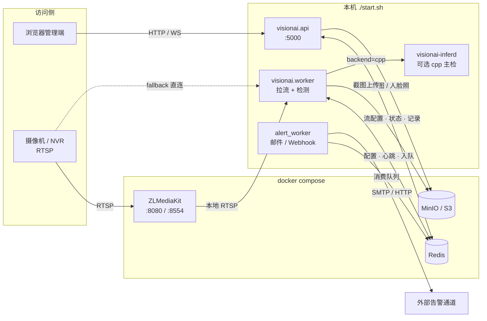
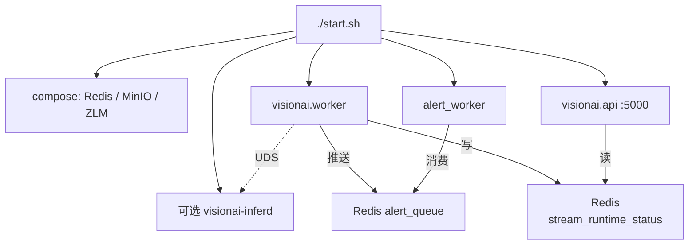
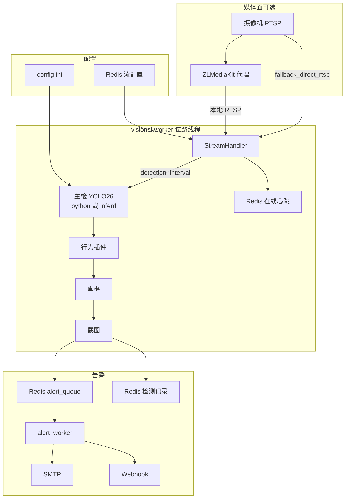
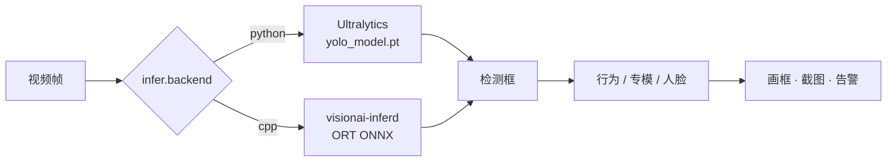
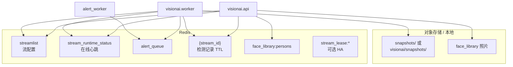

# 系统架构

JXVisionAI：多路 RTSP 视频智能分析。主检为 **Ultralytics YOLO26**（COCO 80），之上叠加行为扩展、**专模**（平台自训或导入社区权重）与 Web 管理端。

---

## 功能一览

| 能力 | 说明 |
|------|------|
| 多路 RTSP | 每路独立线程；读帧失败自动重连；离线流周期性探测恢复 |
| COCO 80 类 | 按流单独开关（人物、手机、车辆等） |
| 内置扩展 | 打电话、玩手机、人员聚集、人脸识别 |
| 训练专模 / 导入专模 | 部署或导入到 `models/specialists/<key>/`，出现在检测类型列表，可删 |
| 打电话 / 玩手机 | 人与手机框重叠后，可用 **YOLO26-pose** 区分贴耳与把玩 |
| 人脸识别 | buffalo_l（SCRFD + ArcFace）；可选性别年龄；库在 Redis，照片在 MinIO |
| 人员聚集 | 单帧人数 ≥ 阈值，可选持续时长防抖 |
| 告警 | Redis 记录 + 可选 SMTP / Webhook；截图本地或 MinIO/S3 |
| Web | 状态、事件监控、历史、设置、人脸库、预览；`/training` 训练实验室（自训 + 导入） |
| 可选 C++ 主检 | `visionai-inferd`（ORT），`[infer] backend=cpp` 时由 `start.sh` 拉起 |

流配置只在 **Redis**（Web「事件监控」）。改 `config.ini` / 主模型 / 设备后需 **重启**。专模部署一般热加载。

---

## 架构总览



数据面要点：

- **配置与状态**：流配置、在线心跳、检测记录、告警队列 → Redis  
- **对象**：告警截图、人脸库照片 → MinIO（可关，仅本地 `snapshots/`）  
- **媒体**：可选 ZLM 代理；失败且 `fallback_direct_rtsp=true` 时 worker 直连摄像机  

---

## 进程模型

```text
./start.sh
  ├─ docker compose：Redis / MinIO /（可选）ZLMediaKit
  ├─（可选）visionai-inferd     # [infer] backend=cpp
  ├─ python -m visionai.workers.alert_worker   # 异步告警队列消费
  ├─ python -m visionai.worker                 # 拉流 + 检测
  └─ python -m visionai.api                    # Flask :5000
```



主检后端：

| `[infer] backend` | 行为 |
|-------------------|------|
| `python`（默认） | 每路 Ultralytics 加载 `yolo_model`（.pt） |
| `cpp` | 帧送 `visionai-inferd`（ORT session 池并行）；行为/画框/告警仍在 Python |

媒体面：`[zlm] enabled=true` 时由 ZLMediaKit `addStreamProxy` 拉摄像机，检测从本机 `rtsp://127.0.0.1:8554/live/<stream_id>` 取流；`fallback_direct_rtsp=true`（默认）时代理失败回退直连源站 RTSP。

多节点：设 `STREAM_LEASE_ENABLED=true`，见 [ha.md](ha.md)。

### 进程职责与状态共享

| 进程 | 职责 |
|------|------|
| `visionai.api` | Flask 管理端、预览、配置读写；**不拉流** |
| `visionai.worker` | 每路 RTSP 线程：读帧 → 主检 → 行为 → 截图 → 入队告警；写流在线状态 |
| `alert_worker` | 消费 Redis `alert_queue`，发邮件 / Webhook |
| `visionai-inferd` | 可选；`backend=cpp` 时提供 ORT 主检 |

流「在线/离线」由 **worker** 写入 Redis Hash `{key_prefix}stream_runtime_status`（JSON：`status` + `updated_at`），API 跨进程读取。超过约 **180s** 未刷新的「在线」按离线展示。勿再理解为仅 API 进程内存。

遗留入口 `python -m visionai`（`__main__.py`）仍可单进程同跑 Web + 拉流，**生产请用 `./start.sh` 多进程**。

---

## 单路处理流水线



主检分支（`python` / `cpp`）：



---

## 行为与专模

| 类型 | 键 / 位置 | 说明 |
|------|-----------|------|
| 打电话 | `call` | 可选 `make_call.onnx`，否则 COCO+姿态 |
| 玩手机 | `phone_play` | 主检融合逻辑 |
| 人员聚集 | `gather` | 人数 + 时长 |
| 人脸识别 | `face_recognition` | `models/buffalo_l/` + Redis 库 |
| 专模 | `models/specialists/<key>/` | 自训或导入；吸烟/安全帽/眼镜等非硬编码 |

---

## YOLO26 主模型档位

官方文档：<https://docs.ultralytics.com/models/yolo26/>  
权重 Release：<https://github.com/ultralytics/assets/releases/tag/v8.4.0>

| 文件 | 体量（约） | COCO mAP 趋势 | 适用 |
|------|------------|---------------|------|
| `yolo26n.pt` | ~5 MB | 较低 | 多路 / 边缘，优先速度 |
| `yolo26s.pt` | ~20 MB | 默认推荐 | 精度与速度平衡 |
| `yolo26m.pt` | ~43 MB | 更高 | 提高召回 |
| `yolo26l.pt` | ~51 MB | 更高 | 精度优先 |
| `yolo26x.pt` | ~114 MB | 最高 | 单路或高算力 |

切换：改 `[models] yolo_model`，然后 `./stop.sh && ./start.sh`。  
对比精度时建议固定 `conf_threshold`、同一路流与场景，只改模型档位。  
`backend=cpp` 时还需把对应权重导出到 `models/repo/primary/<version>/model.onnx`（见 [getting-started.md](getting-started.md)）。

---

## 数据存储

默认键前缀 `visionai/`（`[redis] key_prefix`）。



| 数据 | 位置 |
|------|------|
| 流配置 | Redis Hash `{prefix}streamlist` |
| 流在线状态 | Redis Hash `{prefix}stream_runtime_status`（worker 心跳；超时约 180s） |
| 异步告警队列 | Redis List `{prefix}alert_queue`（及 `alert_queue:dead`） |
| 流租约（HA） | Redis `{prefix}stream_lease:{stream_id}` |
| 检测记录 | Redis Hash `{prefix}{stream_id}` + TTL（`detection_retention_days`） |
| 截图 | `snapshots/` 或 S3（`visionai/snapshots/`） |
| 人脸库 | Redis `face_library:persons` + MinIO 照片 |
| 专模 | `models/specialists/<key>/` |
| 日志 | `logs/visionai.log`、`worker.log`、`alert_worker.log`（及 `inferd.log`） |

Compose 依赖：**Redis + MinIO + ZLMediaKit**；应用进程由本机 `./start.sh` 拉起（compose 内 `visionai` 服务块默认注释）。

---

## 仓库结构（摘要）

```
visionai/           # Python 包：api / worker / 检测 / Web / 配置
native/inferd/      # 可选 C++ 推理守护进程（[infer] backend=cpp）
config/             # config.example.ini、config.ini、zlm/config.ini
models/             # YOLO26*.pt、buffalo_l、specialists、repo/
docs/               # 本目录：架构与使用说明
scripts/            # 工具脚本（含 download_yolo26.sh）
start.sh / stop.sh  # 多进程启停（不停止 Redis/MinIO/ZLM 容器）
docker-compose.yaml # Redis + MinIO + zlmediakit
```

更细的操作步骤见 [getting-started.md](getting-started.md)、[configuration.md](configuration.md)、[user-guide.md](user-guide.md)。
