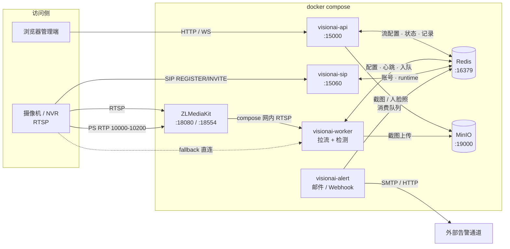
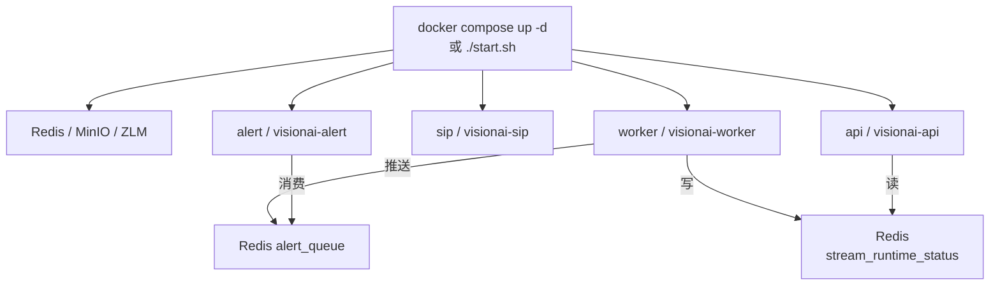
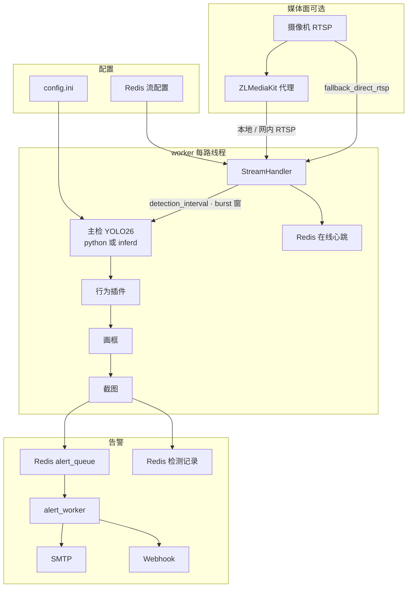
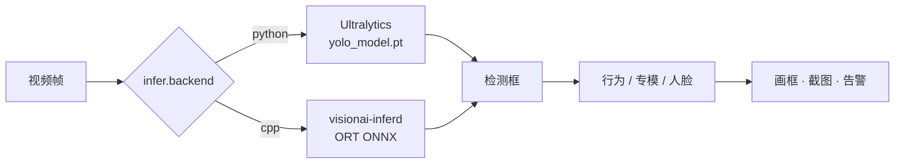
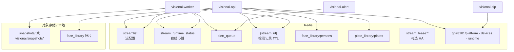

# 系统架构

JXVisionAI：多路 RTSP / ONVIF / 国标 28181 视频智能分析。主检为 **Ultralytics YOLO26**（COCO 80），之上叠加行为扩展、**专模**（平台自训或导入社区权重）与 Web 管理端。

---

## 功能一览

| 能力 | 说明 |
|------|------|
| 多路接入 | RTSP直连、ONVIF 发现、国标 28181（独立 SIP 进程注册 + ZLM 收 PS；**通道**「接入分析」写入 streamlist）；每路独立线程拉流。接入平台与接入分析分离（`analyze`） |
| COCO 80 类 | 按流单独开关（人物、手机、车辆等） |
| 内置扩展 | 玩手机、人员聚集、人脸识别、车牌识别、疲劳驾驶（DMS） |
| 训练专模 / 导入专模 | 部署或导入到 `models/specialists/<key>/`，出现在检测类型列表，可删 |
| 玩手机 | 人与手机框重叠后，可用 **YOLO26-pose** 辅助判定把玩（贴耳打电话能力已下线，需自训专模） |
| 人脸识别 | buffalo_l（SCRFD + ArcFace）；可选性别年龄；库在 Redis，照片在 MinIO |
| 车牌识别 | 专模 `plate` 检框 + RapidOCR 读号 + Redis 车牌库（known / unknown） |
| 疲劳驾驶 | 准入闸 + 常连/突发密检窗 + SCRFD/眼区 PERCLOS、哈欠、低头；不合格机位拒绝 |
| 人员聚集 | 单帧人数 ≥ 阈值，可选持续时长防抖 |
| 告警 | Redis 记录 + 可选 SMTP / Webhook；截图本地或 MinIO/S3 |
| Web | 管理端为 Flask + 原生 JS。主界面 `templates/admin.html` 壳 + `templates/admin/_*.html` 分片，样式/脚本在 `static/admin/` 按页拆分。状态概览、设备接入、视频预览、检测配置、历史、设置、平台接入；人脸库/车牌库/训练实验室为独立页。 |
| 语音对讲 | ONVIF RTSP Audio Backchannel（探测 + 浏览器采麦 G.711 回传）；GB28181 对讲未实现 |
| 可选 C++ 主检 | `visionai-inferd`（ORT），`[infer] backend=cpp` 时由宿主机 `start.sh` 或自定义编排拉起 |

流配置在 **Redis**（`access_method` + 拉流 `url` + `analyze` + 检测/告警策略）。国标分三组：SIP 信令 / 媒体收流 / 设备账号（`gb28181/platform`、`gb28181/devices`），互不回退。改 `config.ini` / 主模型 / 拉流地址后需 **重启**；检测策略一般热加载。SIP 监听变更需重启 `visionai-sip`。国标细节见 [gb28181.md](gb28181.md)。

> **打电话**：内置 `call` / `make_call` 与默认 `phone_call` 专模已移除。需要时在训练实验室用「自定义」自训或导入 YOLO 专模后上线。

---

## 两种部署形态

| 形态 | 说明 | 管理端 |
|------|------|--------|
| **整栈 Docker（推荐）** | `docker compose up -d`：Redis + MinIO + ZLM + `visionai-api` / `visionai-worker` / `visionai-alert` / `visionai-sip` | <http://IP:15000> |
| **宿主机多进程** | compose 只起依赖；`./start.sh` 起 API / worker / alert / sip | <http://IP:5000> |

当前仓库 `docker-compose.yaml` 已包含应用服务（同镜像 `visionai:latest`，`command` 分别为 `api` / `worker` / `alert` / `sip`），挂载 `./config`、`./models`、`./visionai`、`./snapshots`、`./logs`。

Compose 全服务 **host 网络**（ONVIF WS-Discovery 组播、国标 RTP 收流需要宿主机网络），端口直接绑宿主机（避开常见本机占用）：

| 用途 | 宿主机端口 |
|------|------------|
| Web / API | **15000**（容器 `PORT=15000`） |
| Redis | **16379** |
| MinIO API / 控制台 | **19000** / **19001** |
| ZLM HTTP | **18080** |
| ZLM RTSP | **18554** |
| ZLM RTMP | **11935** |
| ZLM WebRTC | **18000**（tcp/udp） |
| 国标 SIP | **15060**（tcp/udp；平台默认监听 15060） |
| 国标 PS/RTP | **10000–10200**（tcp+udp；Invite 占用独立口，跳过 10000） |

---

## 架构总览



数据面要点：

- **配置与状态**：流配置、在线心跳、检测记录、告警队列 → Redis  
- **对象**：告警截图、人脸库照片 → MinIO（可关，仅本地 `snapshots/`）  
- **媒体**：可选 ZLM 代理；失败且 `fallback_direct_rtsp=true` 时 worker 直连摄像机  

---

## 进程模型

### 整栈 Compose

```text
docker compose up -d
  ├─ redis / minio / zlmediakit
  ├─ visionai-api      # Flask，宿主机 :15000
  ├─ visionai-worker   # 拉流 + 检测（WORKER_ID=compose-worker-1）
  ├─ visionai-alert    # 异步告警队列消费
  └─ visionai-sip      # 国标 SIP :15060
```

改配置或主模型后：

```bash
docker compose restart visionai-api visionai-worker visionai-alert
```

SIP 监听或国标平台参数变更后再：`docker compose restart visionai-sip`。

### 宿主机 `./start.sh`（开发 / 对照）

```text
./start.sh
  ├─ docker compose：Redis / MinIO /（可选）ZLMediaKit
  ├─（可选）visionai-inferd     # [infer] backend=cpp
  ├─ python -m visionai.workers.alert_worker
  ├─ python -m visionai.sip                    # 国标信令（默认 :15060）
  ├─ python -m visionai.worker
  └─ python -m visionai.api                    # Flask :5000
```



主检后端：

| `[infer] backend` | 行为 |
|-------------------|------|
| `python`（默认） | 每路 Ultralytics 加载 `yolo_model`（.pt） |
| `cpp` | 帧送 `visionai-inferd`（ORT session 池并行）；行为/画框/告警仍在 Python |

媒体面：`[zlm] enabled=true` 时由 ZLMediaKit `addStreamProxy` 拉摄像机。  
- **Compose 网内**：worker 常用 `ZLM_PULL_HOST=zlmediakit`、容器内 RTSP `:554`  
- **浏览器 / 宿主机**：HTTP `18080`、RTSP `18554`、WebRTC `18000`（见 `config.ini` `[zlm]`）  
`fallback_direct_rtsp=true`（默认）时代理失败回退直连源站 RTSP。

多节点：设 `STREAM_LEASE_ENABLED=true`，见 [ha.md](ha.md)。

### 进程职责与状态共享

| 进程 / 容器 | 职责 |
|-------------|------|
| `visionai-api` / `visionai.api` | Flask 管理端、预览、配置读写；**不拉流** |
| `visionai-worker` / `visionai.worker` | 每路 RTSP 线程：读帧 → 到点开一轮短窗抽帧 → 主检/行为 → 命中率聚合 → 截图 → 入队告警；写流在线状态 |
| `visionai-alert` / `alert_worker` | 消费 Redis `alert_queue`，发邮件 / Webhook |
| `visionai-inferd` | 可选；`backend=cpp` 时提供 ORT 主检 |
| `visionai-sip` / `visionai.sip` | 国标 REGISTER / Keepalive / Catalog / Invite；写 `gb28181/runtime`；启动时清空在线缓存 |

流「在线/离线」分两层：

- **分析流**：由 **worker** 写入 Redis Hash `{key_prefix}stream_runtime_status`（JSON：`status` + `updated_at`），API 跨进程读取。超过约 **180s** 未刷新的「在线」按离线展示。仅 `analyze=true` 且未暂停的流会拉流检测。
- **国标 SIP 账号**：由 **sip** 写 `gb28181/runtime`。设备列表只显示 SIP 注册状态；Invite 还需要进程内会话（重启后等心跳重建，见 [gb28181.md](gb28181.md)）。

遗留入口 `python -m visionai`（`__main__.py`）仍可单进程同跑 Web + 拉流，**生产请用 Compose（api/worker/alert/sip）或 `./start.sh`**。

---

## 单路处理流水线



主检分支（`python` / `cpp`）：



---

## 行为与专模

| 类型 | 键 / 位置 | 说明 |
|------|-----------|------|
| 玩手机 | `phone_play` | COCO person+cellphone 重叠 + 可选姿态 |
| 人员聚集 | `gather` | 人数 + 时长 |
| 人脸识别 | `face_recognition` | `models/buffalo_l/` + Redis 库 |
| 车牌识别 | `plate_recognition` | `models/specialists/plate/` + RapidOCR + Redis 车牌库 |
| 疲劳驾驶 | `fatigue_driving` | `visionai/core/dms/`：闸 + 密检窗 + PERCLOS；车内正脸 |
| 专模 | `models/specialists/<key>/` | 自训或导入；如跌倒、口罩、积水、吸烟、枪支、刀具等 |

仓库内常见专模目录示例（以实际 `models/specialists/` 为准）：`facemask`、`fall`、`plate`、`puddle`、`gun`、`knife`。

---

## YOLO26 主模型档位

官方文档：<https://docs.ultralytics.com/models/yolo26/>  
权重 Release：<https://github.com/ultralytics/assets/releases/tag/v8.4.0>

| 文件 | 体量（约） | COCO mAP 趋势 | 适用 |
|------|------------|---------------|------|
| `yolo26n.pt` | ~5 MB | 较低 | 多路 / 边缘，优先速度 |
| `yolo26s.pt` | ~20 MB | 默认推荐 | 精度与速度平衡 |
| `yolo26m.pt` | ~43 MB | 更高 | 提高召回 |
| `yolo26l.pt` | ~51 MB | 更高 | 精度优先 |
| `yolo26x.pt` | ~114 MB | 最高 | 单路或高算力 |

切换：改 `[models] yolo_model`，然后重启应用（Compose：`docker compose restart visionai-api visionai-worker visionai-alert`；宿主机：`./stop.sh && ./start.sh`）。  
对比精度时建议固定 `conf_threshold`、同一路流与场景，只改模型档位。  
`backend=cpp` 时还需把对应权重导出到 `models/repo/primary/<version>/model.onnx`（见 [getting-started.md](getting-started.md)）。

---

## 数据存储

默认键前缀 `visionai/`（`[redis] key_prefix`）。



| 数据 | 位置 |
|------|------|
| 流配置 | Redis Hash `{prefix}streamlist`（含 `access_method`、`analyze`） |
| 流在线状态 | Redis Hash `{prefix}stream_runtime_status`（worker 心跳；超时约 180s） |
| 国标平台/账号/运行时 | Redis `{prefix}gb28181/platform`、`devices`、`runtime`、`sip_alive` |
| 异步告警队列 | Redis List `{prefix}alert_queue`（及 `alert_queue:dead`） |
| 流租约（HA） | Redis `{prefix}stream_lease:{stream_id}` |
| 检测记录 | Redis Hash `{prefix}{stream_id}` + TTL（`detection_retention_days`） |
| 截图 | `snapshots/` 或 S3（`visionai/snapshots/`） |
| 人脸库 | Redis `face_library:persons` + MinIO 照片 |
| 车牌库 | Redis `plate_library:plates` |
| 专模 | `models/specialists/<key>/` |
| 日志 | `logs/visionai.log`、`worker.log`、`alert_worker.log`、`sip.log`（及 `inferd.log`） |

---

## 仓库结构（摘要）

```
visionai/           # Python 包：api / worker / 检测 / Web / 配置
native/inferd/      # 可选 C++ 推理守护进程（[infer] backend=cpp）
config/             # config.example.ini、config.ini、zlm/config.ini
models/             # YOLO26*.pt、buffalo_l、specialists、repo/
docs/               # 本目录：架构与使用说明
scripts/            # 工具脚本（含 download_yolo26.sh、compose_up.sh）
start.sh / stop.sh  # 宿主机多进程启停（不停止 Redis/MinIO/ZLM 容器）
docker-compose.yaml # Redis + MinIO + ZLM + api/worker/alert/sip
```

更细的操作步骤见 [getting-started.md](getting-started.md)、[configuration.md](configuration.md)、[user-guide.md](user-guide.md)。
