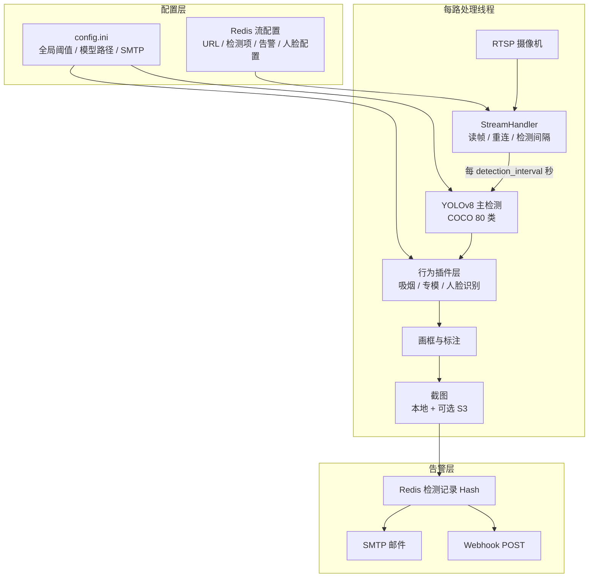

# 系统架构

## 功能一览

| 能力 | 说明 |
|------|------|
| 多路 RTSP | 每路独立线程；读帧失败自动重连；离线流周期性探测恢复 |
| COCO 80 类 | 按流单独开关（人物、手机、车辆等），见 `detection_catalog.py` |
| 扩展检测 | 吸烟、打电话、睡觉、安全帽、跌倒、火焰等专模（`.pt` / `.onnx`） |
| 打电话 / 玩手机 | 人与 `cell phone` 框重叠后，可用 **YOLOv8-pose** 区分贴耳通话与把玩 |
| **人脸识别** | buffalo_l（SCRFD + ArcFace）检测对齐；按流可选性别年龄；Redis 人脸库 1:N；照片存 MinIO |
| 人员聚集 | 单帧人数 ≥ 阈值，可选持续时长防抖 |
| 告警外发 | 写 Redis 后按 `save_interval` 触发 **SMTP** 与 **Webhook** |
| 对象存储 | 可选 MinIO / 云 S3；截图键前缀 `visionai/snapshots/` |
| Web 管理端 | 状态概览、事件监控、历史告警、系统设置、人脸库、流预览 |
| Web 训练实验室 | `/training`：采图→标注审核→train/val/test→门禁部署（可上线专模） |

流配置**只存在 Redis** 中（Web「事件监控」维护），不再硬编码在 `settings.py`。保存后一般**下一轮检测周期即生效**；修改 `config.ini` 或模型文件后需 **重启进程**。

---

## 进程模型

单进程 `python3 -m jxvisionai` 同时运行：

1. **Flask Web 服务**（默认 `0.0.0.0:5000`）— 管理端、API、流预览
2. **每路 RTSP 处理线程** — 拉流 → 检测 → 截图 → 写 Redis → 发告警
3. **离线流探测线程** — 周期性尝试拉起已配置但离线的流
4. **禁用流状态线程** — 维护已禁用流在界面上的状态

---

## 单路处理流水线



---

## 行为插件层

`jxvisionai/core/behaviors/` 采用插件注册模式（`registry.py`）：

| 插件 | 键名 | 依赖 |
|------|------|------|
| 吸烟 | `smoking` | YOLO 专模或 ViT ONNX |
| 打电话专模 | `call` | `make_call.onnx` |
| 人脸检测（专模） | `face` | `face_detection.onnx` |
| **人脸识别** | `face_recognition` | `models/buffalo_l/` + 人脸库 |
| 跌倒 / 火焰 / 口罩等 | 各扩展键 | 对应 `models/*.onnx` 或 `.pt` |

人脸识别与 COCO「人物」检测独立：仅开「人脸识别」时仍会加载 YOLO 主模型（当前架构要求），行为层单独跑 SCRFD + ArcFace。

---

## 数据存储

| 数据 | 位置 | 说明 |
|------|------|------|
| 流配置 | Redis `visionai:streams` | Web 事件监控读写 |
| 检测记录 | Redis Hash + TTL | `detection_retention_days` 控制过期 |
| 告警截图 | `snapshots/` 或 S3 | `save_interval` 限流 |
| 人脸库元数据 | Redis `visionai/face_library:persons` | 姓名、特征向量、照片 object_key |
| 人脸库照片 | MinIO `visionai/face_library/{person_id}/photo.jpg` | 录入时上传，需开启对象存储 |
| 日志 | `logs/visionai.log` | 按日轮转 |

---

## 仓库结构

```
# 仓库根目录（GitHub 仓库名 JXVisionAI；Python 包名 jxvisionai）
├── jxvisionai/                    # Python 包（python -m jxvisionai）
│   ├── __main__.py                # 入口：流线程 + Flask
│   ├── config/
│   │   ├── settings.py            # 配置加载（env > ini > 默认）
│   │   ├── detection_catalog.py   # COCO + 扩展检测目录
│   │   ├── config_schema.py       # 系统设置页字段 schema
│   │   └── ini_manager.py         # ini 结构化读写
│   ├── core/
│   │   ├── detector.py            # YOLO 检测 + 结果融合 + 画框
│   │   ├── stream_handler.py      # RTSP 连接与帧读取
│   │   ├── redis_manager.py       # 流配置与检测记录
│   │   ├── face_engine.py         # buffalo_l ONNX（检测 + 特征 + 可选性别年龄）
│   │   ├── face_library.py        # 人脸库 CRUD + 1:N 比对
│   │   ├── face_recognition_config.py
│   │   ├── behaviors/             # 行为插件（吸烟、人脸识别等）
│   │   ├── object_storage.py      # S3/MinIO
│   │   └── preview_*.py           # MJPEG / WebSocket / HLS / WebRTC 预览
│   ├── utils/                     # 日志、RTSP URL、邮件、Webhook
│   └── web/
│       ├── app.py                 # Flask 路由
│       └── templates/             # admin.html、face_library.html 等
├── config/
│   ├── config.example.ini         # 配置模板（入库）
│   └── config.ini                 # 本地生效配置（.gitignore）
├── models/                        # 模型统一目录（权重不入 Git）
│   ├── yolov8n.pt                 # YOLO 主模型（须自备）
│   ├── yolov8n-pose.pt            # 姿态模型（可选）
│   ├── buffalo_l/                 # 人脸识别（须自备）
│   │   ├── det_10g.onnx
│   │   └── w600k_r50.onnx
│   └── *.onnx / *.pt              # 各专模扩展
├── face_library/                  # 旧版本地库（启动时自动迁移到 Redis+MinIO）
├── scripts/
│   └── test_face_recognition.py   # 人脸识别 CLI 测试
├── docs/                          # 项目文档
├── snapshots/   logs/             # 运行产物（.gitignore）
├── training_system/               # 离线训练管线
├── training_lab_data/             # Web 训练实验室数据
├── docker-compose.yaml            # Redis + MinIO（应用默认宿主机跑）
├── Dockerfile
├── start.sh   stop.sh
└── requirements.txt
```
