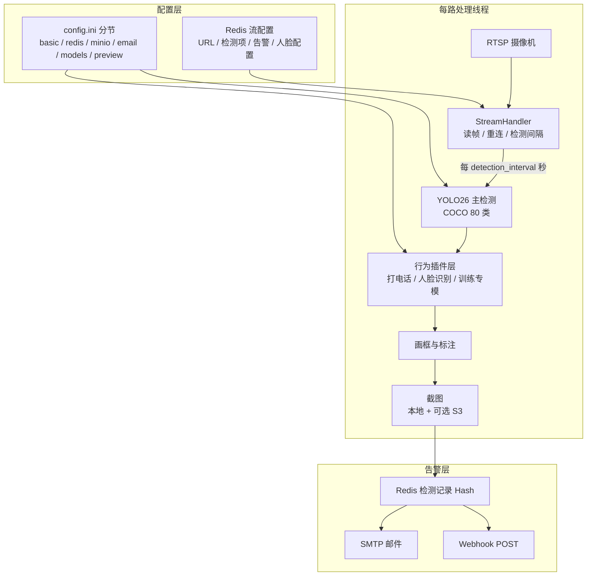

# 系统架构

## 功能一览

| 能力 | 说明 |
|------|------|
| 多路 RTSP | 每路独立线程；读帧失败自动重连；离线流周期性探测恢复 |
| COCO 80 类 | 按流单独开关（人物、手机、车辆等），见 `detection_catalog.py` |
| 内置扩展 | 打电话、玩手机、人员聚集、人脸识别 |
| 训练专模 | 训练实验室部署到 `models/specialists/<key>/`，出现在检测类型配置中，可删 |
| 打电话 / 玩手机 | 人与 `cell phone` 框重叠后，可用 **YOLO26-pose** 区分贴耳通话与把玩 |
| **人脸识别** | buffalo_l（SCRFD + ArcFace）；按流可选性别年龄；Redis 人脸库 1:N；照片存 MinIO |
| 人员聚集 | 单帧人数 ≥ 阈值，可选持续时长防抖 |
| 告警外发 | 写 Redis 后按 `save_interval` 触发 **SMTP** 与 **Webhook** |
| 对象存储 | 可选 MinIO / 云 S3；截图键前缀 `visionai/snapshots/` |
| Web 管理端 | 状态概览、事件监控、历史告警、系统设置、人脸库、流预览 |
| Web 训练实验室 | `/training`：采图→标注审核→train/val/test→门禁部署 |

流配置**只存在 Redis**（Web「事件监控」维护）。保存后一般**下一轮检测周期即生效**。  
修改 `config.ini` / 主模型路径 / `inference_device` 后需 **重启进程**。  
训练专模部署到 `models/specialists/` 后插件**热加载**，一般无需重启。

---

## 进程模型

单进程 `python3 -m visionai` 同时运行：

1. **Flask Web 服务**（默认 `0.0.0.0:5000`）— 管理端、API、流预览
2. **每路 RTSP 处理线程** — 拉流 → 检测 → 截图 → 写 Redis → 发告警
3. **离线流探测线程** — 周期性尝试拉起已配置但离线的流
4. **禁用流状态线程** — 维护已禁用流在界面上的状态

---

## 单路处理流水线



---

## 行为插件层

`visionai/core/behaviors/` 采用插件注册（`registry.py`）：

| 插件 | 键名 | 依赖 |
|------|------|------|
| 打电话专模 | `call` | 可选 `make_call.onnx`；否则 COCO+姿态 |
| **人脸识别** | `face_recognition` | `models/buffalo_l/` + 人脸库 |
| 训练专模 | 动态键 | `models/specialists/<key>/`（scene / person_event / violation） |

玩手机 `phone_play`、人员聚集 `gather` 在主检测融合逻辑中实现，不单独占专模插件。

吸烟、安全帽、眼镜、跌倒等**不再硬编码**；经训练实验室部署为专模后出现在检测类型列表。

---

## 数据存储

| 数据 | 位置 | 说明 |
|------|------|------|
| 流配置 | Redis Hash（`streamlist`） | Web 事件监控读写 |
| 检测记录 | Redis Hash + TTL | `detection_retention_days` 控制过期 |
| 告警截图 | `snapshots/` 或 S3 | `save_interval` 限流 |
| 人脸库元数据 | Redis | 姓名、特征向量、照片 object_key |
| 人脸库照片 | MinIO | 录入时上传，需开启对象存储 |
| 训练专模 | `models/specialists/<key>/` | `model.pt` + `specialist.json` |
| 日志 | `logs/visionai.log` | 按日轮转 |

---

## 仓库结构

```
# 仓库根目录（GitHub：JXVisionAI；Python 包：visionai）
├── visionai/
│   ├── __main__.py
│   ├── config/
│   │   ├── settings.py            # env > ini > 默认；inference_device
│   │   ├── detection_catalog.py   # COCO + 内置扩展
│   │   ├── specialists.py         # 训练专模注册表
│   │   ├── config_schema.py
│   │   └── ini_manager.py
│   ├── core/
│   │   ├── detector.py
│   │   ├── behaviors/             # 人脸识别、打电话专模、动态专模
│   │   ├── face_engine.py         # buffalo_l ONNX
│   │   └── …
│   └── web/
├── config/
│   ├── config.example.ini
│   └── config.ini                 # 本地生效（.gitignore）
├── models/
│   ├── yolo26s.pt / yolo26s-pose.pt / yolo26n.pt
│   ├── buffalo_l/                 # 人脸识别（须自备）
│   └── specialists/               # 训练实验室部署产物
├── docs/
├── training_system/               # 离线 CLI 训练（可选）
├── training_lab_data/             # Web 训练实验室数据
├── docker-compose.yaml            # Redis + MinIO
├── start.sh / stop.sh
└── requirements.txt               # 含 onnxruntime-gpu
```
