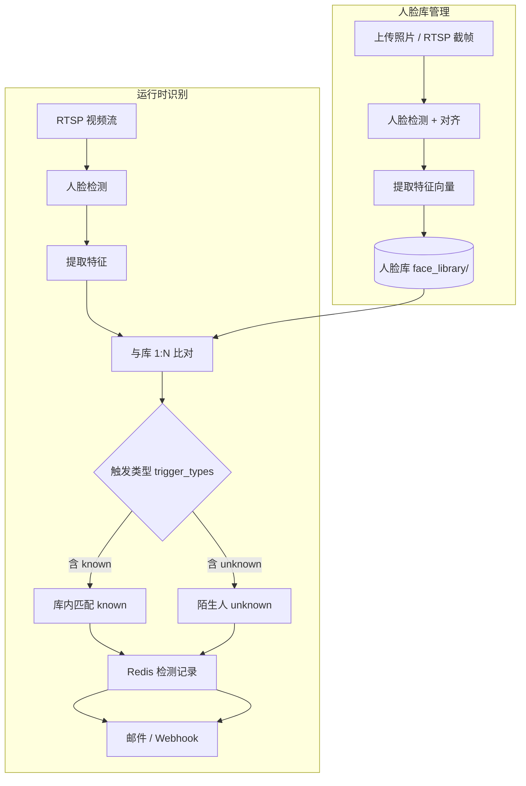
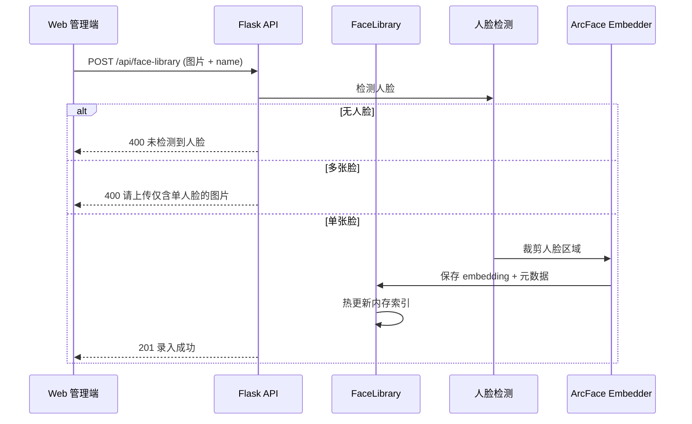

# JXVisionAI 人脸识别功能设计文档

> 版本：v0.1  
> 日期：2026-07-07  
> 状态：设计阶段（待评审）

---

## 1. 背景与目标

### 1.1 业务需求

在现有 JXVisionAI 多路 RTSP 视频分析系统上，新增**人脸识别**能力：

1. **人脸库管理**：系统支持录入、维护人员人脸库。
2. **按流启用**：在某路视频流上独立开启/关闭人脸识别检测。
3. **可配置触发类型**：人脸识别支持以下两种告警触发类型，**按流多选配置**，仅已勾选的类型会写入检测记录并触发告警（邮件 / Webhook）：

| 触发类型 Key | 名称 | 触发条件 |
|-------------|------|---------|
| `known` | 库内匹配 | 检测到人脸，且与人脸库比对成功（相似度 ≥ 阈值） |
| `unknown` | 库外（陌生人） | 检测到人脸，但与人脸库比对失败（相似度 < 阈值） |

**配置示例：**

| 场景 | `trigger_types` | 说明 |
|------|----------------|------|
| 门禁白名单 | `["known"]` | 仅库内人员出现时告警 |
| 陌生人预警 | `["unknown"]` | 仅未录入人员出现时告警 |
| 全面监控 | `["known", "unknown"]` | 两种类型均告警（默认） |

### 1.2 与现有「人脸检测」的区别

| 能力 | 检测项 Key | 现有状态 | 说明 |
|------|-----------|---------|------|
| 人脸检测 | `face` | ✅ 已实现 | `face_detection.onnx`，检测到人脸即告警，无身份 |
| 人脸识别 | `face_recognition` | ❌ 待开发 | 检测人脸 + 提取特征 + 与库 1:N 比对 + 按触发类型配置告警 |

两者**独立检测项**，避免改变现有 `face` 语义，降低回归风险。通常业务场景只开启 `face_recognition` 即可。

### 1.3 可行性结论

**可以实现。** 现有架构已具备：

- 行为插件框架（`visionai/core/behaviors/`）
- 按流检测开关（Redis `detections` 字段）
- 告警入库与通知（`detector.save_snapshot` → Redis → SMTP / Webhook）
- ONNX 推理栈（`onnxruntime`，与吸烟检测同类）

---

## 2. 系统架构

### 2.1 总体数据流



### 2.2 模块划分

```
visionai/
├── core/
│   ├── face_library.py          # 人脸库 CRUD、内存索引、热重载
│   ├── face_embedder.py         # ArcFace ONNX 特征提取
│   └── behaviors/
│       └── face_recognition.py  # FaceRecognitionBehaviorPlugin
├── config/
│   └── detection_catalog.py     # 新增 FACE_RECOG_KEY
└── web/
    ├── app.py                   # 人脸库 API
    └── templates/
        └── face_library.html    # 人脸库管理页（P2）

models/
└── buffalo_l/                     # InsightFace 模型包（已下载，不入 Git）
    ├── det_10g.onnx               # 人脸检测 SCRFD
    ├── 2d106det.onnx              # 106 点关键点（对齐用）
    ├── w600k_r50.onnx             # 特征提取 ArcFace 512 维
    ├── 1k3d68.onnx                # 3D 关键点（本功能不用）
    └── genderage.onnx             # 性别年龄（本功能不用）

face_library/                      # 本地数据目录（不入 Git）
├── index.json
└── persons/{person_id}/
    ├── meta.json
    ├── photo.jpg
    └── embedding.npy

docs/
└── face_recognition_design.md     # 本文档
```

### 2.3 与现有处理链路集成

主循环（`visionai/__main__.py`）不变。在 `Detector.detect()` → `process_results()` → `save_snapshot()` 链路中：

1. `run_behaviors()` 调度 `FaceRecognitionBehaviorPlugin`（当 `detections.face_recognition = true`）。
2. `process_results()` 在画面上标注 `张三 0.82` 或 `陌生人`。
3. `save_snapshot()` 将识别结果写入 Redis，并触发邮件 / Webhook。

---

## 3. 核心功能设计

### 3.1 触发类型（按流可配置）

人脸识别仅有**两种触发类型**，通过 `face_recognition_config.trigger_types` 数组按流勾选，**未勾选的类型只识别、不告警**。

| 触发类型 | 触发条件 | 检测类型展示示例 |
|---------|---------|----------------|
| `known`（库内匹配） | 相似度 ≥ 阈值，且在库中匹配到人员 | `人脸识别: 张三` |
| `unknown`（陌生人） | 检测到人脸，但最高分 < 阈值（或库为空时的所有脸） | `人脸识别: 陌生人` |

**配置规则：**

- `trigger_types` 为字符串数组，元素仅允许 `"known"` / `"unknown"`，至少选一项。
- 默认值：`["known", "unknown"]`（两种均启用）。
- 插件始终完成检测与比对；是否写入 Redis / 发告警，由 `trigger_types` 过滤 `alert_matches`。

**判定逻辑：**

```
若 face_library 为空：
  - trigger_types 含 known   → 库内匹配类永不告警（Web 提示「请先录入人脸库」）
  - trigger_types 含 unknown → 所有检测到的人脸均视为陌生人并告警
  - 仅含 known               → 该流不产生任何人脸识别告警

若 face_library 非空：
  - 对每张脸做 1:N 比对，取最高相似度 best_sim、对应 person
  - best_sim >= threshold → match_type = "known"
  - best_sim <  threshold → match_type = "unknown"
  - match_type 在 trigger_types 中 → 进入 alert_matches，否则跳过
```

**常见配置对照：**

| trigger_types | 库内人员出现 | 陌生人出现 |
|--------------|------------|-----------|
| `["known"]` | ✅ 告警 | ❌ 不告警 |
| `["unknown"]` | ❌ 不告警 | ✅ 告警 |
| `["known", "unknown"]` | ✅ 告警 | ✅ 告警 |

### 3.2 人脸库管理

#### 3.2.1 存储结构

```
face_library/
├── index.json                    # 人员索引（不含 embedding）
└── persons/
    └── {person_id}/
        ├── meta.json             # 姓名、部门、备注、时间戳
        ├── photo.jpg             # 录入原图（首张或主图）
        └── embedding.npy         # 512 维 float32 特征向量
```

**index.json 示例：**

```json
{
  "version": 1,
  "persons": [
    {
      "id": "p_a1b2c3",
      "name": "张三",
      "department": "安保部",
      "remark": "",
      "photos": 1,
      "created_at": "2026-07-07T10:00:00",
      "updated_at": "2026-07-07T10:00:00"
    }
  ]
}
```

**meta.json 示例：**

```json
{
  "id": "p_a1b2c3",
  "name": "张三",
  "department": "安保部",
  "remark": "白班门卫",
  "photos": [
    {
      "file": "photo.jpg",
      "embedding": "embedding.npy",
      "created_at": "2026-07-07T10:00:00"
    }
  ]
}
```

#### 3.2.2 录入流程



#### 3.2.3 内存索引

启动时及每次 CRUD 后，`FaceLibrary` 将所有 embedding 加载至内存：

```python
# 内存结构示意
_index: Dict[str, PersonMeta]           # person_id → 元数据
_embeddings: List[Tuple[str, np.ndarray]]  # [(person_id, vec512), ...]
```

比对时对 `_embeddings` 做向量化余弦相似度，百人级耗时 < 1ms。

#### 3.2.4 多人多图（P3 扩展）

- 每人可追加多张照片，每张照片独立 embedding。
- 比对时取该人所有 embedding 的最高相似度作为该人得分。
- 再在所有人员中取全局最高分为最终匹配。

### 3.3 运行时识别插件

#### 3.3.1 插件接口

```python
class FaceRecognitionBehaviorPlugin:
    key = "face_recognition"

    def evaluate(self, ctx: BehaviorContext, state: dict) -> dict:
        ...
```

#### 3.3.2 返回结构

```python
{
    "alert": bool,                    # 是否有符合 trigger_types 的告警
    "boxes": [                        # 本帧所有人脸框
        {
            "box": [x1, y1, x2, y2],
            "confidence": 0.95,
        }
    ],
    "matches": [                      # 每张脸的比对结果
        {
            "box": [x1, y1, x2, y2],
            "person_id": "p_a1b2c3",  # None 表示未匹配
            "person_name": "张三",     # 或 "陌生人"
            "similarity": 0.82,
            "match_type": "known",    # "known" | "unknown"
            "face_key": "f_abc123",   # 用于防抖去重的稳定 key
        }
    ],
    "alert_matches": [...],           # match_type 在 trigger_types 中且通过持续时长过滤的项
    "count": 2,                       # 本帧人脸数
}
```

#### 3.3.3 处理流水线

```
输入帧 (BGR)
  │
  ├─① 人脸检测（models/buffalo_l/det_10g.onnx，SCRFD）
  │
  ├─② 关键点检测 + 仿射对齐（models/buffalo_l/2d106det.onnx → 112×112）
  │
  ├─③ 特征提取（models/buffalo_l/w600k_r50.onnx → 512 维 embedding）
  │
  ├─④ 与 FaceLibrary 做 1:N 余弦相似度比对
  │
  ├─⑤ 按 per-stream trigger_types + threshold + watchlist 过滤
  │
  ├─⑥ apply_keyed_duration_alert 防抖
  │     key = person_id（已知）或 face_key（陌生人）
  │     min_duration_sec 来自流配置或全局默认
  │
  └─⑦ 输出 alert_matches
```

### 3.4 防抖与去重

复用现有 `apply_keyed_duration_alert`（`behaviors/common.py`）：

| 场景 | state key | 说明 |
|------|-----------|------|
| 库内人员 | `person_id` | 同一人持续出现 ≥ N 秒才告警 |
| 陌生人 | `unknown_{face_key}` | `face_key` 由框中心坐标量化生成，避免抖动重复告警 |

配合全局 `SAVE_INTERVAL`（默认 10s）控制截图与 Redis 写入频率。

---

## 4. 模型选型

### 4.1 模型来源（已就绪）

项目已将 InsightFace **`buffalo_l`** 模型包下载至 `models/buffalo_l/`：

| 文件 | 大小 | 用途 | 本功能是否使用 |
|------|------|------|--------------|
| `det_10g.onnx` | ~16 MB | 人脸检测（SCRFD-10GF） | ✅ 人脸识别流水线 |
| `2d106det.onnx` | ~5 MB | 106 点关键点 | ✅ 人脸对齐 |
| `w600k_r50.onnx` | ~166 MB | 特征提取（ResNet50@WebFace600K，512 维） | ✅ 1:N 比对 |
| `1k3d68.onnx` | ~137 MB | 3D 关键点 | ❌ 不使用 |
| `genderage.onnx` | ~1 MB | 性别 / 年龄 | ❌ 不使用 |

> **与现有 `face` 检测项的关系**：现有 `face` 检测项仍走 `face_model_path`（默认 `models/face_detection.onnx`，YOLO 格式）；**人脸识别**独立使用 `buffalo_l` 全套（检测 + 对齐 + 特征），精度更好，互不依赖。

### 4.2 推荐方案

| 环节 | 模型文件 | 配置键 | 默认路径 |
|------|---------|--------|---------|
| 人脸检测 | `det_10g.onnx` | `face_recog_det_model_path` | `models/buffalo_l/det_10g.onnx` |
| 人脸对齐 | `2d106det.onnx` | `face_recog_landmark_model_path` | `models/buffalo_l/2d106det.onnx` |
| 特征提取 | `w600k_r50.onnx` | `face_recog_embed_model_path` | `models/buffalo_l/w600k_r50.onnx` |
| 相似度计算 | NumPy 余弦 | — | 库规模 < 1000 时足够快 |

推理均通过 **`onnxruntime`** 加载，**无需** `pip install insightface`（仅下载模型时需要）。

### 4.3 阈值标定建议

| 相似度范围 | 建议 |
|-----------|------|
| ≥ 0.55 | 高置信匹配 |
| 0.45 ~ 0.55 | 可用区间（建议默认阈值 0.45） |
| < 0.45 | 视为陌生人 |

阈值支持全局默认 + 按流覆盖（`face_recognition_config.threshold`）。

### 4.4 性能预估（单路 1080p，检测间隔 15s）

| 步骤 | 耗时 |
|------|------|
| 人脸检测 | 30–80 ms |
| 特征提取（每张脸） | 20–50 ms |
| 1:N 比对（100 人） | < 1 ms |
| 合计（3 张脸/帧） | ~100–200 ms |

可通过 `FACE_RECOGNITION_MAX_FACES_PER_FRAME` 限制每帧处理人脸数（默认 5）。

---

## 5. 配置设计

### 5.1 全局配置（config.ini / 环境变量）

| 键 | 环境变量 | 默认值 | 说明 |
|----|---------|--------|------|
| `face_recog_det_model_path` | `FACE_RECOG_DET_MODEL_PATH` | `models/buffalo_l/det_10g.onnx` | 人脸识别专用检测 |
| `face_recog_landmark_model_path` | `FACE_RECOG_LANDMARK_MODEL_PATH` | `models/buffalo_l/2d106det.onnx` | 关键点对齐 |
| `face_recog_embed_model_path` | `FACE_RECOG_EMBED_MODEL_PATH` | `models/buffalo_l/w600k_r50.onnx` | 512 维特征提取 |
| `face_recognition_threshold` | `FACE_RECOGNITION_THRESHOLD` | `0.45` | 全局相似度阈值 |
| `face_recognition_min_duration_sec` | `FACE_RECOGNITION_MIN_DURATION_SEC` | `2.0` | 全局持续时长防抖 |
| `face_library_dir` | `FACE_LIBRARY_DIR` | `./face_library` | 人脸库目录 |
| `face_recognition_max_faces_per_frame` | `FACE_RECOGNITION_MAX_FACES_PER_FRAME` | `5` | 每帧最多处理人脸数 |
| `face_recog_det_conf` | `FACE_RECOG_DET_CONF` | `0.5` | SCRFD 检测置信度 |

现有 `face` 检测项配置（与人脸识别独立，可选保留）：

| 键 | 说明 |
|----|------|
| `face_model_path` | 现有 `face` 检测项，默认 `models/face_detection.onnx`（YOLO 格式） |
| `face_model_conf` | 检测置信度阈值 |

### 5.2 检测目录扩展

```python
# detection_catalog.py 新增
FACE_RECOG_KEY = "face_recognition"

EXTENSION_LABELS_ZH[FACE_RECOG_KEY] = "人脸识别"

EXTENSION_CATALOG_META 追加:
{
    "key": "face_recognition",
    "name_en": "face recognition (library match / stranger alert)",
    "name_zh": "人脸识别（库内匹配 / 陌生人）",
}
```

归类为 `SCENE_BEHAVIOR_KEYS`（场景级，不依赖 YOLO person 框）。

### 5.3 按流配置扩展

在 Redis `streamlist` 的流对象中扩展：

```json
{
  "id": "stream_938a7923",
  "name": "大门入口",
  "url": "rtsp://192.168.1.100/stream1",
  "enabled": true,
  "detections": {
    "0": false,
    "face": false,
    "face_recognition": true,
    "smoking": false
  },
  "face_recognition_config": {
    "trigger_types": ["known", "unknown"],
    "threshold": 0.45,
    "min_duration_sec": 2.0,
    "watchlist": []
  },
  "alert_emails": ["ops@example.com"],
  "alert_email_enabled": true,
  "alert_webhook_urls": ["https://hooks.example.com/alert"],
  "alert_webhook_enabled": true
}
```

**face_recognition_config 字段说明：**

| 字段 | 类型 | 默认 | 说明 |
|------|------|------|------|
| `trigger_types` | string[] | `["known", "unknown"]` | 启用的触发类型，可选 `"known"` / `"unknown"`，至少一项 |
| `threshold` | float | 全局默认 | 覆盖全局相似度阈值 |
| `min_duration_sec` | float | 全局默认 | 覆盖全局防抖时长 |
| `watchlist` | string[] | `[]` | 仅当含 `known` 时生效；白名单人员 ID，空数组表示库内全部人员 |

---

## 6. 数据存储与告警记录

### 6.1 Redis 检测记录扩展

现有 `save_detection()` 结构基础上，增加 `extra` 字段（向后兼容）：

```json
{
  "id": "1720000000",
  "stream_id": "stream_938a7923",
  "stream_name": "大门入口",
  "detection_types": ["人脸识别: 张三"],
  "image_path": "./snapshots/大门入口/20260707_100015.jpg",
  "object_key": "",
  "storage_kind": "",
  "timestamp": "2026-07-07T10:00:15",
  "extra": {
    "face_recognition": {
      "trigger_types": ["known", "unknown"],
      "matches": [
        {
          "person_id": "p_a1b2c3",
          "person_name": "张三",
          "similarity": 0.82,
          "match_type": "known",
          "box": [100, 200, 180, 280]
        }
      ]
    }
  }
}
```

**detection_types 展示规则：**

| match_type | 展示 |
|-----------|------|
| `known` | `人脸识别: {person_name}` |
| `unknown` | `人脸识别: 陌生人` |

同一帧多张脸、多种类型时，`detection_types` 可含多项，如 `["人脸识别: 张三", "人脸识别: 陌生人"]`。

### 6.2 画面标注

| 类型 | 标注文字 | 颜色建议 |
|------|---------|---------|
| 库内匹配 | `张三 0.82` | 绿色 `(0, 200, 0)` |
| 陌生人 | `陌生人 0.31` | 红色 `(0, 0, 220)` |

### 6.3 邮件 / Webhook 扩展

在现有 `notify_alert_by_email` / `notify_alert_by_webhooks` 正文中追加：

```
检测类型: 人脸识别: 张三
相似度: 0.82
匹配类型: 库内人员
```

陌生人告警：

```
检测类型: 人脸识别: 陌生人
最高相似度: 0.31（低于阈值 0.45）
```

---

## 7. API 设计

所有接口需登录（复用现有 session 鉴权）。

### 7.1 人脸库管理

| 方法 | 路径 | 说明 |
|------|------|------|
| `GET` | `/api/face-library` | 获取人员列表（不含 embedding） |
| `GET` | `/api/face-library/{id}` | 获取单个人员详情 |
| `POST` | `/api/face-library` | 录入人员（`multipart/form-data`: `photo` + `name` + 可选 `department`/`remark`） |
| `PUT` | `/api/face-library/{id}` | 更新姓名 / 部门 / 备注 |
| `DELETE` | `/api/face-library/{id}` | 删除人员及文件 |
| `POST` | `/api/face-library/{id}/photos` | 追加录入照片 |
| `DELETE` | `/api/face-library/{id}/photos/{photo_id}` | 删除某张录入照片 |
| `GET` | `/api/face-library/{id}/photo` | 获取录入照片 |
| `POST` | `/api/face-library/reload` | 手动重载内存索引 |

**POST /api/face-library 响应示例：**

```json
{
  "id": "p_a1b2c3",
  "name": "张三",
  "similarity_self_check": 1.0,
  "message": "录入成功"
}
```

**错误码：**

| HTTP | 场景 |
|------|------|
| 400 | 未检测到人脸 / 多张人脸 / 图片格式无效 |
| 404 | 人员不存在 |
| 500 | 模型加载失败 / 磁盘写入失败 |

### 7.2 流配置（复用现有）

| 方法 | 路径 | 变更 |
|------|------|------|
| `GET` | `/api/streams` | 响应含 `face_recognition_config` |
| `POST` | `/api/streams` | 请求体支持 `face_recognition_config` |
| `GET` | `/api/detection-catalog` | 含 `face_recognition` 检测项 |

### 7.3 检测记录（复用现有）

| 方法 | 路径 | 变更 |
|------|------|------|
| `GET` | `/api/detections` | 响应含 `extra.face_recognition`；类型筛选支持「人脸识别」 |

---

## 8. Web 界面设计

### 8.1 新增页面：人脸库管理

路径：`/face-library`（或管理端新菜单 Tab）

| 区域 | 功能 |
|------|------|
| 人员列表 | 姓名、部门、录入时间、照片数、操作（编辑 / 删除） |
| 录入表单 | 上传图片 + 姓名 + 部门 + 备注 |
| 预览 | 点击查看录入原图 |

### 8.2 事件监控页扩展

在现有「检测项配置」弹窗中：

1. 新增复选框：**人脸识别**
2. 展开子配置：
   - **触发类型**（多选，至少一项）：
     - ☑ 库内匹配（`known`）
     - ☑ 陌生人（`unknown`）
   - 相似度阈值（可选，留空用全局）
   - 持续时长（可选）
   - 白名单人员（多选，仅勾选 `known` 时显示）

### 8.3 历史告警页扩展

- 类型筛选增加「人脸识别」
- 表格类型列展示 `人脸识别: 张三` 或 `人脸识别: 陌生人`
- 详情可展开显示相似度、人脸框坐标（读 `extra` 字段）

### 8.4 与现有 `face` 的 UI 提示

当同时勾选 `face` 与 `face_recognition` 时，显示提示：

> 已开启人脸识别，通常无需同时开启「人脸检测」，否则可能产生重复告警。

---

## 9. 代码改动清单

| 文件 | 改动类型 | 说明 |
|------|---------|------|
| `visionai/config/detection_catalog.py` | 修改 | 新增 `FACE_RECOG_KEY`、标签、目录元数据 |
| `visionai/config/settings.py` | 修改 | 新增全局配置项 |
| `visionai/config/config_schema.py` | 修改 | 配置页字段描述 |
| `visionai/core/face_embedder.py` | **新增** | ArcFace ONNX 加载与推理 |
| `visionai/core/face_library.py` | **新增** | 库 CRUD、索引、比对 |
| `visionai/core/behaviors/face_recognition.py` | **新增** | 识别插件 |
| `visionai/core/behaviors/registry.py` | 修改 | 注册插件 |
| `visionai/core/detector.py` | 修改 | 画框、save_snapshot 处理识别结果 |
| `visionai/core/redis_manager.py` | 修改 | `save_detection` 支持 `extra` |
| `visionai/utils/alert_email.py` | 修改 | 邮件正文含识别信息 |
| `visionai/utils/alert_webhook.py` | 修改 | Webhook payload 含识别信息 |
| `visionai/web/app.py` | 修改 | 人脸库 API、页面路由 |
| `visionai/web/templates/admin.html` | 修改 | 流配置 UI |
| `visionai/web/templates/face_library.html` | **新增** | 人脸库管理页 |
| `config/config.example.ini` | 修改 | 新增配置项示例 |
| `.gitignore` | 修改 | 忽略 `face_library/` |
| `requirements.txt` | 不变 | 复用 onnxruntime + numpy |

---

## 10. 分阶段实施计划

### P0：核心能力（可脚本验证）

- [ ] `face_embedder.py`：ArcFace ONNX 加载与 512 维提取
- [ ] `face_library.py`：目录结构、CRUD、内存索引、1:N 比对
- [ ] 命令行脚本 `scripts/test_face_recognition.py`：录入 + 比对验证

**验收标准：** 录入 3 人照片，对测试图正确识别 / 标记陌生人。

### P1：接入告警链路

- [ ] `FaceRecognitionBehaviorPlugin` 实现
- [ ] `detection_catalog` / `registry` / `detector` 集成
- [ ] 按流 `face_recognition_config` 读写
- [ ] Redis 记录 `extra.face_recognition`
- [ ] 邮件 / Webhook 扩展

**验收标准：** 某路 RTSP 开启 `face_recognition`，库内 / 陌生人均能入库告警。

### P2：Web 管理界面

- [ ] 人脸库管理页（列表、录入、删除）
- [ ] 事件监控检测项 + 触发类型配置
- [ ] 历史告警展示识别姓名

**验收标准：** 全流程可通过 Web 完成，无需改 Redis 手工配置。

### P3：生产增强

- [ ] 多人多图录入
- [ ] RTSP 预览截帧录入
- [ ] `watchlist` 白名单
- [ ] 人脸质量过滤（过小、模糊跳过）
- [ ] 性能监控日志

---

## 11. 风险与对策

| 风险 | 影响 | 对策 |
|------|------|------|
| 光照 / 角度变化导致误识 | 陌生人被判为库内人员 | 可调阈值；多人多图录入；持续时长防抖 |
| 侧脸 / 遮挡 | 漏检或低相似度 | 检测置信度过滤；过低质量不告警 |
| 模型文件需自备 | 部署失败 | 文档说明下载路径；启动时检测并日志告警 |
| 人脸库为空且含 `known` | 库内匹配类永不告警 | Web 提示；API 返回库状态 |
| 与 `face` 重复告警 | 噪音 | UI 互斥提示；默认只开 `face_recognition` |
| 多实例部署 | 库不同步 | P3 前假设单实例；后续可 Redis 同步元数据 + 共享存储 |

---

## 12. 安全与合规

| 项 | 措施 |
|----|------|
| 数据隐私 | `face_library/` 不入 Git；生产环境限制文件权限 |
| API 鉴权 | 复用现有登录 session；录入 / 删除需认证 |
| 审计 | 录入 / 删除操作写应用日志 |
| 保留策略 | 人脸库不受 `DETECTION_RETENTION_DAYS` 影响；检测截图仍按现有策略过期 |

---

## 13. 测试计划

### 13.1 单元测试

- `FaceLibrary`：录入、删除、比对、空库边界
- `FaceEmbedder`：单脸提取向量维度与归一化
- `FaceRecognitionBehaviorPlugin`：`trigger_types` 组合、阈值、防抖

### 13.2 集成测试

- 流配置保存 → 下轮检测生效
- 库内人员出现 → Redis 记录含 `person_name`
- 陌生人出现 → `detection_types` 含 `人脸识别: 陌生人`
- 邮件 / Webhook 正文含识别信息

### 13.3 场景测试

| 场景 | 预期 |
|------|------|
| 库内员工正面入镜 | `known` 告警，显示姓名 |
| 未录入人员入镜 | `unknown` 告警 |
| 库内员工，`trigger_types=["unknown"]` | 不告警 |
| 陌生人，`trigger_types=["known"]` | 不告警 |
| 同一人持续 1s（防抖 2s） | 不告警 |
| 同一人持续 3s | 告警 |

---

## 14. 附录

### 14.1 比对算法（余弦相似度）

```python
def cosine_similarity(a: np.ndarray, b: np.ndarray) -> float:
    a = a / (np.linalg.norm(a) + 1e-8)
    b = b / (np.linalg.norm(b) + 1e-8)
    return float(np.dot(a, b))
```

1:N 比对：对所有库内向量计算相似度，取 `(best_person_id, best_sim)`。

### 14.2 person_id 生成

```python
import uuid
person_id = "p_" + uuid.uuid4().hex[:12]
```

### 14.3 配置示例（config.ini 片段）

```ini
[visionai]
# 人脸识别（buffalo_l，已下载至 models/buffalo_l/）
face_recog_det_model_path = models/buffalo_l/det_10g.onnx
face_recog_landmark_model_path = models/buffalo_l/2d106det.onnx
face_recog_embed_model_path = models/buffalo_l/w600k_r50.onnx
face_recog_det_conf = 0.5
face_recognition_threshold = 0.45
face_recognition_min_duration_sec = 2.0
face_library_dir = ./face_library
face_recognition_max_faces_per_frame = 5

# 现有 face 检测项（与人脸识别独立，可选）
# face_model_path = models/face_detection.onnx
# face_model_conf = 0.5
```

### 14.4 模型文件说明

`models/buffalo_l/` 已包含 InsightFace 官方 `buffalo_l` 包，**无需复制或重命名**。不入 Git 仓库。

| 文件 | 用途 |
|------|------|
| `models/buffalo_l/det_10g.onnx` | 人脸识别 — 检测 |
| `models/buffalo_l/2d106det.onnx` | 人脸识别 — 对齐 |
| `models/buffalo_l/w600k_r50.onnx` | 人脸识别 — 特征提取 |

来源：[InsightFace Model Zoo](https://github.com/deepinsight/insightface) · `buffalo_l`（ResNet50@WebFace600K）。许可限非商业科研用途，生产商用需另行确认。

---

## 15. 评审确认项

实施前请确认：

- [ ] 触发类型 `known` / `unknown` 多选配置是否满足全部业务场景
- [ ] 默认阈值 `0.45` 是否可接受（可用实测样本标定）
- [ ] 人脸库存本地文件是否满足部署环境（单机 / 是否需要共享存储）
- [ ] 是否需要 P2 前先做 P0+P1 后端验证
- [ ] 是否与现有 `face` 检测项合并展示或保持独立

---

*文档结束*
